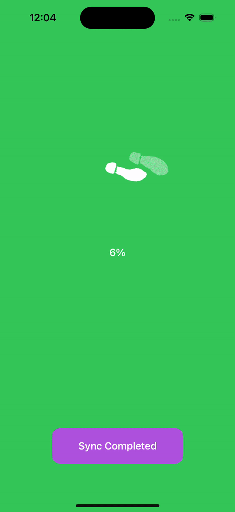

# Demo Sequence Images Loading
This is a demo of sequence images loading with Sequence Images loading Swift Package.
This project is the showcase of MVVM architecture, following SOLID principles, SwiftUI, SwiftCombine, GCD and how to integrate UIKit to SwiftUI.

# Features 
- Load sequence images as progress bar.
- Aniamate updated values.
    
# Techniques
- SwiftUI: to develop User Interfaces
- Integrate UIKit to SwiftUI
- SwiftCombine: to bind data
- Grand central Dispatch (GCD): to multithread 
- MVVM architecture: develop application
- Quick, Nimble framework: to write UnitTest
- Follow SOLID principles

## Environment
- XCode 15.0 ++
- iOS 17 ++

## How to run
To run demo, we need to install some libraries from Swift Packages Manager:
- SequenceImagesLoading [Github page](https://github.com/thebeckz007/SequenceImagesLoading.git)

To run Unit-test, we need to install some libraries from Swift Packages Manager:
- Quick
- Nimble
- View Inspector [Github page](https://github.com/nalexn/ViewInspector)
